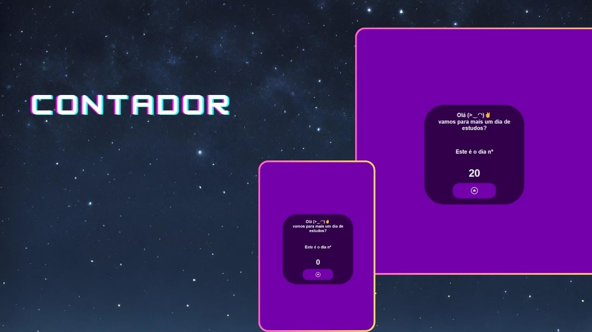

<h1 align="center"> Contador </h1>

Projeto promovido por mim e uma pequena ajuda de um dev pleno.  

  <a href="#-tecnologias">Tecnologias</a>&nbsp;&nbsp;&nbsp;|&nbsp;&nbsp;&nbsp;
  <a href="#-projeto">Projeto</a>&nbsp;&nbsp;&nbsp;&nbsp;&nbsp;&nbsp;
  

 

  

## 🚀 Tecnologias

Esse projeto foi desenvolvido com as seguintes tecnologias:

- HTML e CSS
- JavaScript
- Git e Github
- Canva

## 💻 Projeto

O Contador e um programa que ira contar seus dias estudador e guardar a informação no Local Storage do navegador.

- [Acesse o projeto em fase beta, online](https://leonardops.github.io/projetoDevLinks)

---
